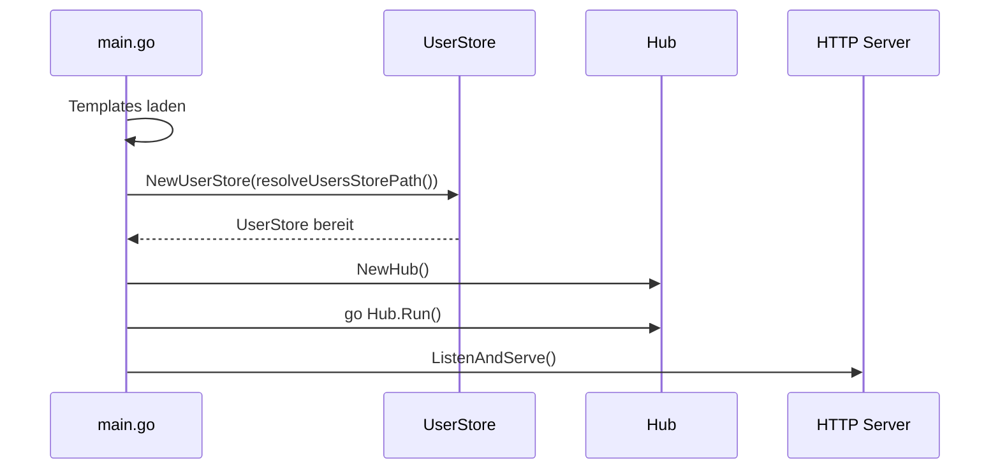
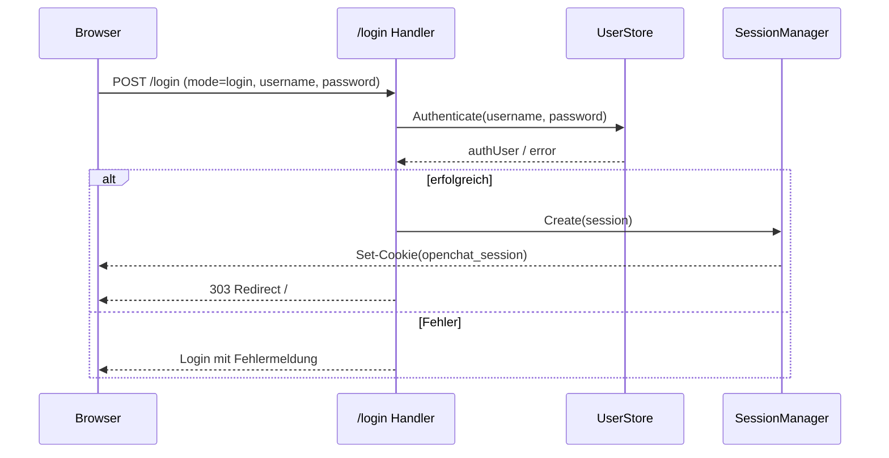
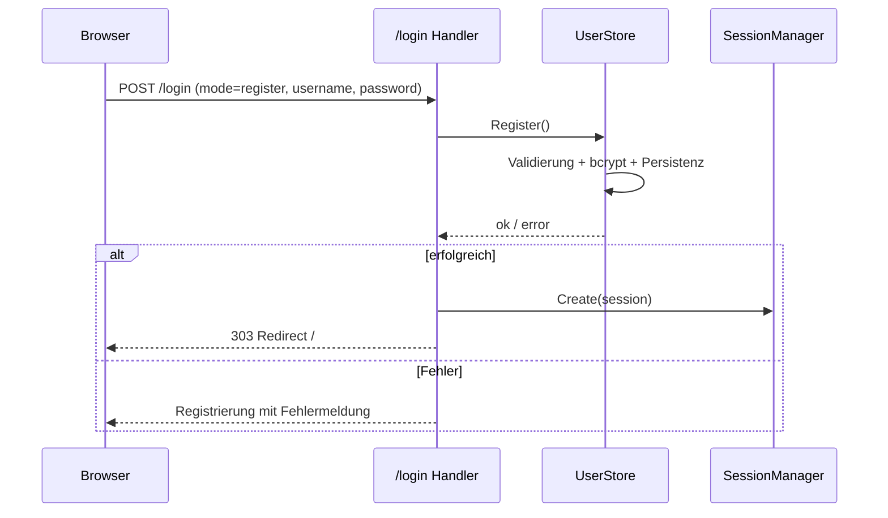
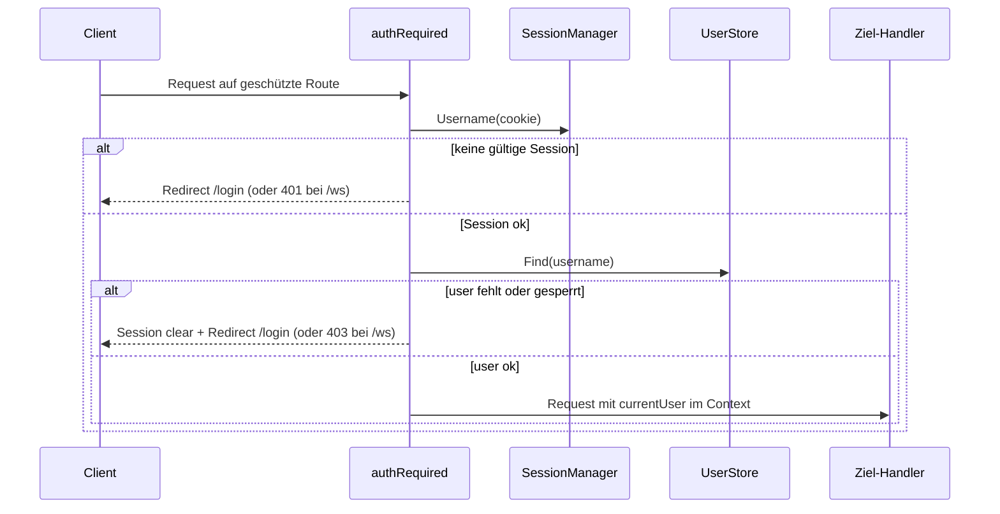
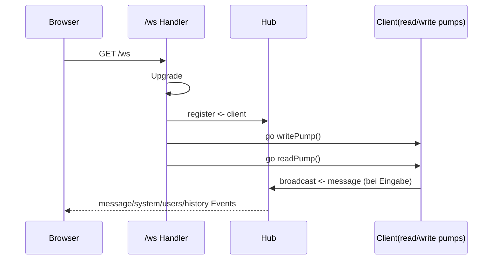
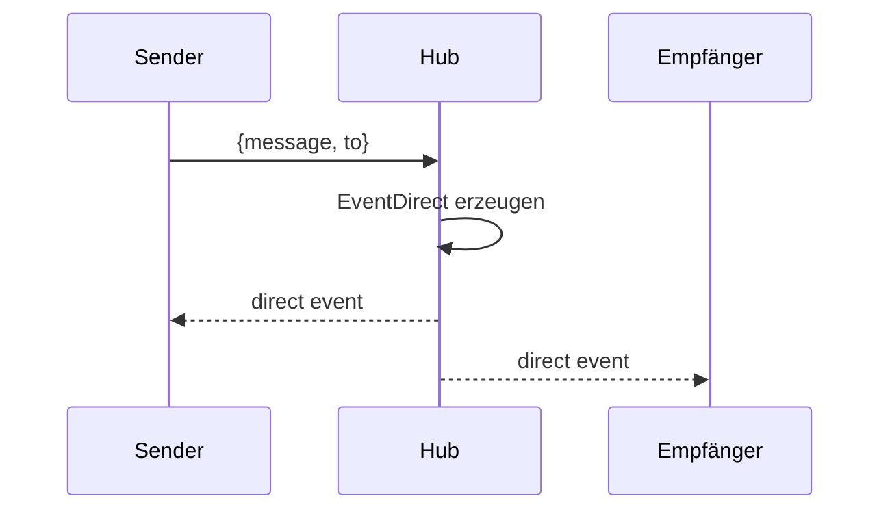
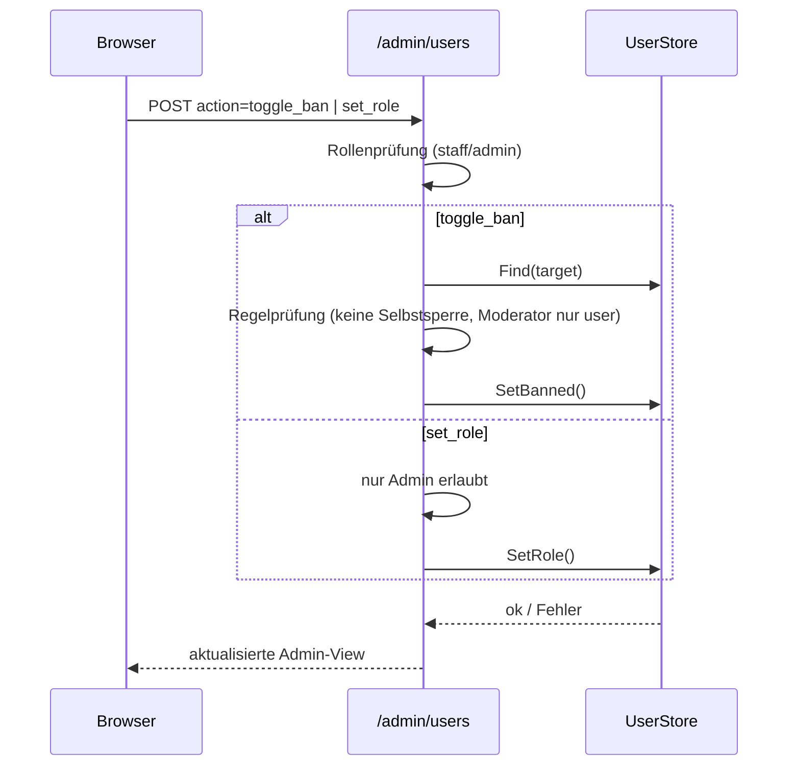

# Open chat – Entwickler-Doku

## Überblick

Diese Doku beschreibt die technische Struktur sowie zentrale Flows mit Sequenzabläufen.

---

## 1. Komponenten

### Backend

- `main.go` – Bootstrap, Routing, Lifecycle
- `auth.go` – UserStore, Auth, Session, Rollen-/Ban-Regeln
- `admin.go` – Benutzerverwaltung
- `websocket.go` – HTTP->WebSocket Upgrade
- `hub.go` – Event-Broker für Chat
- `client.go` – Read/Write-Pump pro Client

### Frontend

- `templates/index.html` – Chat-View
- `templates/login.html` – Auth-View
- `templates/admin.html` – Benutzerverwaltung
- `static/app.js` – WebSocket-Client, Rendering, Reconnect
- `static/style.css` + `static/css/*` – modulare Styles

---

## 2. Laufzeit-Flow (Serverstart)

---

## 3. Auth-Flow (Login)

---

## 4. Registrierungs-Flow

---

## 5. Auth-Middleware-Flow

---

## 6. WebSocket-Flow

## 6.1 Direktnachrichten-Flow

---

## 7. Admin-/Moderator-Flow (Ban/Role)

---

## 8. Datenhaltung: JSON vs SQLite

Auswahl über Dateiendung von `OPENCHAT_USERS_FILE`:

- `.json` -> JSON-Datei
- `.db`, `.sqlite`, `.sqlite3` -> SQLite

SQLite-Schema wird automatisch angelegt (`users`-Tabelle).

---

## 9. Frontend-Flow (app.js)

1. Seite lädt, Splash sichtbar
2. `connect()` öffnet WebSocket
3. Bei `open`: Status online, Splash ausblenden
4. Bei `message`: Events rendern (`history`, `message`, `system`, `users`)
5. Bei `close/error`: Reconnect mit Backoff

---

## 10. Teststrategie (aktuell)

`go test ./...` deckt zentrale Regeln ab:

- Admin-Schutzregeln
- Ban-Verhalten
- Zugriffsmiddleware
- SQLite-Persistenz
- Env-basierte Store-Pfadauflösung

---

## 11. Erweiterungspunkte

- restriktive `CheckOrigin` Strategie
- persistente Chat-History
- Audit-Log für Adminaktionen
- konfigurierbarer Server-Port via Env
